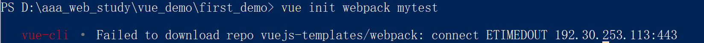

# 创建vue报错解决： Failed to download repo vuejs-templates/webpack: connect ETIMEDOUT 192.30.253.112:443

> win10中创建vue工程时出现问题报错解决
>
> 已经通过npm安装了node, webpack, vue, vue-cli

## 问题产生

执行命令`vue init webpack projectname` 进行初始创建vue，结果报错如图




## 解决方法

#### 1.尝试ping github

打开终端cmd, 输入指令`ping github.com` 来检测是否可以ping通。显示超时。

#### 2.查看host文件

通过路径`C:\Windows\System32\drivers\etc` 打开`host` 文件。查看是否是如下面这个默认配置。如果不是，就还原成如下的默认配置。

```shell
# Copyright (c) 1993-2009 Microsoft Corp.
#
# This is a sample HOSTS file used by Microsoft TCP/IP for Windows.
#
# This file contains the mappings of IP addresses to host names. Each
# entry should be kept on an individual line. The IP address should
# be placed in the first column followed by the corresponding host name.
# The IP address and the host name should be separated by at least one
# space.
#
# Additionally, comments (such as these) may be inserted on individual
# lines or following the machine name denoted by a '#' symbol.
#
# For example:
#
#      102.54.94.97     rhino.acme.com          # source server
#       38.25.63.10     x.acme.com              # x client host
 
# localhost name resolution is handled within DNS itself.
#   127.0.0.1       localhost
#   ::1             localhost
```

#### 3.查看github的ip

通过网址`http://ping.chinaz.com/github.com` 查看github的ip地址。


点击Ping检测，然后往下翻，去检测结果里找可以ping通，不连接超时的ip。


然后记下这个ip地址，返回去修改Host文件

#### 4.修改host文件

在刚刚2中查看的host文件的后面加上如下：

``` shell
140.82.113.3 github.com
151.101.88.249 github.global.ssl.fastly.net
```

 #### 5.再ping检测

再在cmd中ping一下github，看是否可以ping通。

已经可以ping通了。


然后就ok了。再次尝试`vue init webpack projectname` ，成功。